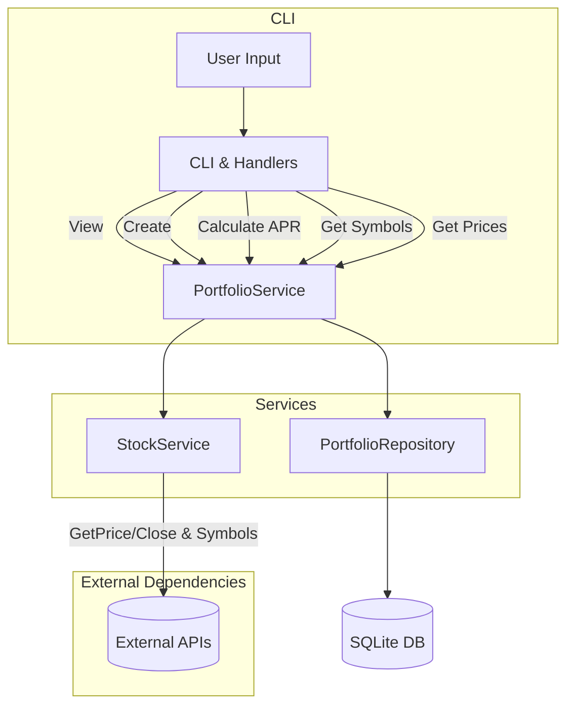

# Stock Manager CLI

This is a command-line application designed to simplify portfolio management for stock investments. It allows users to view existing portfolios, create them manually or randomly (picking from S&P 500 symbols), and calculate APR (Annual Percentage Rate) based on historical prices. The goal is to provide a straightforward, testable, and maintainable codebase suitable for a job application demonstration.

## Key Features

- **View Portfolios**: List all saved portfolios and their stocks, including purchase dates and prices.
- **Create Portfolios Manually**: Choose stocks from the S&P 500, specify quantity and purchase date, then save the portfolio.
- **Create Random Portfolio**: Automatically pick random stocks and assign random purchase dates to generate a portfolio.
- **APR Calculation**: Calculate the APR for a given portfolio over a specified period, fetching historical prices and computing returns.
- **S&P 500 Symbols**: Obtain a list of S&P 500 symbols and prices from an external API, with tests simulating the API responses.

## High-Level Architecture



### Explanation

- **CLI & Handlers:** The user interacts via a menu-driven CLI. Commands (view, create, random, etc.) go through handlers.
- **PortfolioService:** Central logic connecting the CLI to the repository and the stock service.
- **StockService:** Obtains prices and symbols from external APIs.
- **Repository (SQLite):** Stores and retrieves portfolios and their stocks.
- **External APIs:** Simulated or real services providing S&P 500 symbols and historical prices.

## Requirements

- **Go 1.18+** (or current stable Go version)
- **Docker & Docker Compose** (optional, if you prefer containerized execution)

## Configuration

Place a `.env` file in the project root if desired. For example:
```bash
FMP_API_KEY=your_api_key_here
```
You can obtain a free API key from https://site.financialmodelingprep.com/login. If you do not provide `FMP_API_KEY`, the application will still run but you won't get prices automatically from the API and will need to input them manually.

## Running Locally

1. **Clone the Repository:**
```bash
git clone https://github.com/fcopulgar/stock-manager-go.git
cd stock-manager-go
```
2**Run Without Docker:** Ensure you have Go installed, then:
```bash
go build -o stock-manager cmd/main.go
./stock-manager
```
Follow the prompts to view or create portfolios.
3. **Run With Docker:**
```bash
git clone https://github.com/fcopulgar/stock-manager-go.git
cd stock-manager-go
```
* Build the image: 
```bash
docker build -t stock-manager-go .
```
* Run the container:
```bash
docker run --rm -it stock-manager-go
```
4. Run With Docker Compose: Use the docker-compose.yml:
```bash
docker-compose up --build
```
Once started, you can attach to the container and run the CLI.

## Testing

### Running Tests Locally
```bash
go test ./...
```
This runs unit tests for all packages, including mocks and simulated APIs.

### Running Tests With Docker
```bash
docker run --rm -it stock-manager-go go test ./...
```
Or with Docker Compose:
```bash
docker-compose run --rm app go test ./...
```

## Notes

* **Configuration:** `.env` file or system environment variables are used for configuration.
* **Data Persistence:** By default, SQLite database is stored in `portfolios.db`. When running tests in memory, no file is created.